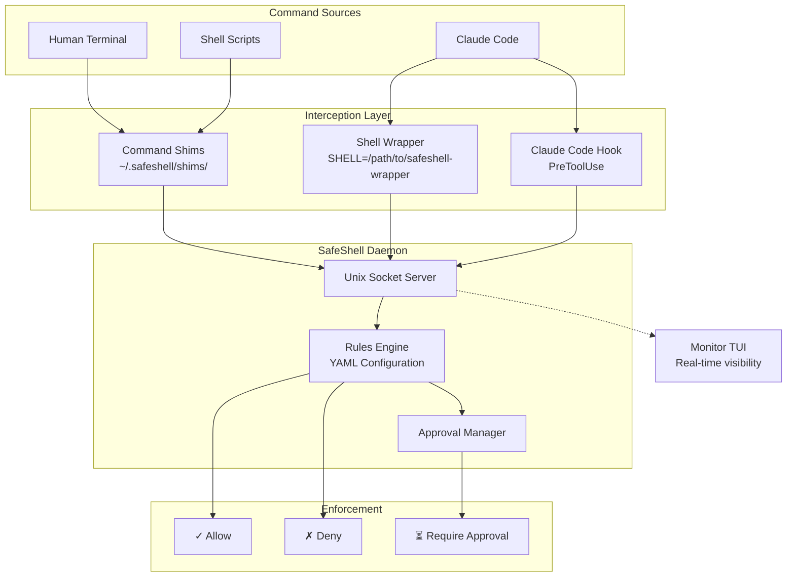

# World-Class README - PR Breakdown

**Purpose**: Detailed implementation breakdown of World-Class README into manageable, atomic pull requests

**Scope**: Complete README transformation from minimal 6-line placeholder to professional thai-lint quality

**Overview**: Comprehensive breakdown of the World-Class README feature into 2 manageable, atomic
    pull requests. Each PR is designed to be self-contained, testable, and maintains application functionality
    while incrementally building toward the complete feature. Includes detailed implementation steps, file
    structures, testing requirements, and success criteria for each PR.

**Dependencies**: None - this is the first phase of the production roadmap

**Exports**: PR implementation plans, file structures, testing strategies, and success criteria for each development phase

**Related**: AI_CONTEXT.md for feature overview, PROGRESS_TRACKER.md for status tracking

**Implementation**: Atomic PR approach with detailed step-by-step implementation guidance and comprehensive testing validation

---

## Overview
This document breaks down the World-Class README feature into manageable, atomic PRs. Each PR is designed to be:
- Self-contained and testable
- Maintains a working application
- Incrementally builds toward the complete feature
- Revertible if needed

---

## PR1: Core README Structure

### Scope
Create the foundational README structure with visual elements and high-level content.

### Files to Modify
- `README.md` (complete rewrite)

### Detailed Steps

#### Step 1: Badge Section
Create badge section at top of README:

```markdown
# SafeShell

[](https://opensource.org/licenses/MIT)
[](https://www.python.org/downloads/)
[](https://github.com/be-wise-be-kind/safeshell/actions/workflows/test.yml)
[](https://codecov.io/gh/be-wise-be-kind/safeshell)
```

**Note**: Some badges may not render until CI/CD is set up (Phase 2). Use placeholder text if needed.

#### Step 2: One-Liner and Value Proposition
After badges, add compelling description:

```markdown
**Command-line safety layer for AI coding assistants.**

SafeShell intercepts shell commands from AI tools like Claude Code, evaluates them against configurable rules, and enforces decisions before execution. Protect your system from accidental `rm -rf`, prevent exposure of sensitive files, and maintain control over what AI assistants can do on your machine.
```

#### Step 3: "Why SafeShell?" Section
Explain the problem and solution:

```markdown
## Why SafeShell?

AI coding assistants are powerful but operate with your shell permissions. Without guardrails:
- A misunderstood request could delete important files
- Sensitive data (SSH keys, credentials) could be exposed
- Destructive git operations could corrupt repositories
- System configurations could be modified unexpectedly

SafeShell provides:
- **Rule-Based Protection**: YAML-configured rules match commands by pattern, context, or bash conditions
- **Approval Workflow**: Require human approval for risky operations
- **Real-Time Monitoring**: Watch all commands in a terminal UI
- **Context Awareness**: Different rules for AI tools vs human operators
```

#### Step 4: Architecture Overview with Mermaid
Create visual architecture diagram:

```markdown
## Architecture

SafeShell uses a hybrid shim + daemon architecture for comprehensive command interception:



#### Step 5: Feature Highlights
Add feature section with bullet points:

```markdown
## Features

### Command Interception
- **Shim-based interception** for external commands (git, rm, docker, etc.)
- **Shell function overrides** for builtins (cd, source, eval)
- **AI tool hooks** for Claude Code integration
- **Transparent pass-through** for allowed commands

### Rules Engine
- **YAML configuration** with global and per-repository rules
- **Bash conditions** for complex matching logic
- **Context-aware filtering** with `ai_only` and `human_only` rules
- **Action types**: allow, deny, require_approval, redirect

### Monitor TUI
- **Real-time event stream** of all intercepted commands
- **Approval workflow** with approve/deny buttons
- **Debug mode** for rule evaluation visibility
- **Keyboard navigation** for efficient operation

### Integrations
- **Claude Code** via PreToolUse hook
- **Shell integration** via init.bash sourcing
```

### Testing Requirements
- [ ] README renders correctly on GitHub
- [ ] All badges display (or show expected placeholder state)
- [ ] Mermaid diagram renders in GitHub preview
- [ ] No broken markdown formatting

### Success Criteria
- [ ] Badge section complete with 4+ badges
- [ ] Value proposition explains SafeShell in 2-3 sentences
- [ ] "Why SafeShell?" addresses the problem clearly
- [ ] Architecture diagram accurately represents system
- [ ] Features section highlights key capabilities

---

## PR2: README Content & Examples

### Scope
Add comprehensive content including installation, usage examples, configuration, and reference sections.

### Files to Modify
- `README.md` (extend from PR1)

### Detailed Steps

#### Step 1: Quick Start Section
Add 5-minute getting started guide:

```markdown
## Quick Start

### 1. Install SafeShell

```bash
# From source (recommended during development)
git clone https://github.com/be-wise-be-kind/safeshell.git
cd safeshell
poetry install
```

### 2. Initialize Configuration

```bash
safeshell init
```

This creates:
- `~/.safeshell/config.yaml` - Global configuration
- `~/.safeshell/rules.yaml` - Global rules
- `~/.safeshell/shims/` - Command shims

### 3. Start the Daemon

```bash
safeshell daemon start
```

### 4. Integrate with Your Shell

Add to your `~/.bashrc` or `~/.zshrc`:

```bash
source ~/.safeshell/init.bash
```

### 5. Test the Setup

```bash
# This should be blocked by default rules
ls test-forbidden-directory

# Check a command without executing
safeshell check "rm -rf /"
```
```

#### Step 2: Installation Section
Expand with all installation methods:

```markdown
## Installation

### Prerequisites
- Python 3.11 or higher
- Poetry (for development installation)

### From Source

```bash
git clone https://github.com/be-wise-be-kind/safeshell.git
cd safeshell
poetry install
```

### Development Installation

```bash
# Clone and install with dev dependencies
git clone https://github.com/be-wise-be-kind/safeshell.git
cd safeshell
poetry install --with dev

# Run tests
poetry run pytest

# Run linting
poetry run ruff check src/
```
```

#### Step 3: Configuration Section
Document configuration options:

```markdown
## Configuration

SafeShell uses YAML configuration files at two levels:

### Global Configuration
`~/.safeshell/config.yaml`:
```yaml
socket_path: /tmp/safeshell.sock
log_level: INFO
approval_timeout_seconds: 300
condition_timeout_ms: 100
```

### Rules Configuration
`~/.safeshell/rules.yaml` (global) and `.safeshell/rules.yaml` (per-repo):

```yaml
rules:
  - name: block-rm-rf
    description: Block recursive force delete
    pattern: "rm -rf"
    action: deny

  - name: approve-git-push-force
    description: Require approval for force push
    pattern: "git push --force"
    action: require_approval

  - name: block-sensitive-files
    description: Block access to SSH keys
    conditions:
      - "echo $SAFESHELL_COMMAND | grep -q '\\.ssh'"
    action: deny
```

See [Rules Guide](.ai/howtos/how-to-write-rules.md) for complete documentation.
```

#### Step 4: CLI Reference Section
Document all CLI commands:

```markdown
## CLI Reference

### Core Commands

| Command | Description |
|---------|-------------|
| `safeshell init` | Initialize configuration and shims |
| `safeshell check "<cmd>"` | Check if a command would be allowed |
| `safeshell status` | Show daemon status |
| `safeshell refresh` | Regenerate shims from rules |

### Daemon Commands

| Command | Description |
|---------|-------------|
| `safeshell daemon start` | Start the background daemon |
| `safeshell daemon stop` | Stop the daemon |
| `safeshell daemon restart` | Restart the daemon |
| `safeshell daemon status` | Check daemon status |

### Monitor Commands

| Command | Description |
|---------|-------------|
| `safeshell monitor` | Launch the monitor TUI |
| `safeshell monitor --debug` | Launch with debug panes visible |
```

#### Step 5: Integration Section
Document Claude Code integration:

```markdown
## Integrations

### Claude Code

SafeShell integrates with Claude Code via a PreToolUse hook that intercepts Bash commands before execution.

**Setup:**

1. Create the hook file at `~/.claude/hooks/safeshell_hook.py`:

```python
# Hook is automatically installed during `safeshell init`
# Located at: ~/.claude/hooks/safeshell_hook.py
```

2. The hook validates commands through the SafeShell daemon before allowing execution.

**Behavior:**
- `allow` rules: Command executes normally
- `deny` rules: Command is blocked with explanation
- `require_approval` rules: Command waits for approval in Monitor TUI
```

#### Step 6: Contributing Section
Add contribution guidelines:

```markdown
## Contributing

Contributions are welcome! Please follow these steps:

1. Fork the repository
2. Create a feature branch (`git checkout -b feature/amazing-feature`)
3. Make your changes
4. Run tests and linting (`poetry run pytest && poetry run ruff check src/`)
5. Commit your changes
6. Push to the branch (`git push origin feature/amazing-feature`)
7. Open a Pull Request

### Development Guidelines
- Write tests for new features
- Follow existing code style (enforced by Ruff)
- Add type hints to all functions
- Update documentation for user-facing changes
```

#### Step 7: Footer Sections
Add license, support, and acknowledgments:

```markdown
## License

MIT License - see [LICENSE](LICENSE) file for details.

## Support

- **Issues**: https://github.com/be-wise-be-kind/safeshell/issues
- **Documentation**: `.ai/docs/` and `.ai/howtos/`

## Acknowledgments

Built with:
- [Typer](https://typer.tiangolo.com/) - CLI framework
- [Textual](https://textual.textualize.io/) - TUI framework
- [Pydantic](https://docs.pydantic.dev/) - Data validation
- [Rich](https://rich.readthedocs.io/) - Terminal formatting
```

### Testing Requirements
- [ ] All code examples are accurate and tested
- [ ] Installation steps work as documented
- [ ] CLI commands match actual implementation
- [ ] Configuration examples are valid YAML
- [ ] All links work (internal and external)

### Success Criteria
- [ ] Quick Start enables functional setup in 5 minutes
- [ ] Installation covers all methods
- [ ] Configuration section is complete and accurate
- [ ] CLI reference matches actual commands
- [ ] Integration section covers Claude Code
- [ ] Contributing guidelines are clear
- [ ] Footer sections are complete

---

## Implementation Guidelines

### Code Standards
- All markdown follows GitHub-flavored markdown specification
- Code blocks use appropriate language hints
- Tables use proper alignment
- Lists use consistent formatting

### Testing Requirements
- Manually verify README renders correctly on GitHub
- Test all code examples in a clean environment
- Verify all links work
- Check Mermaid diagrams render

### Documentation Standards
- **Atemporal language only**: No "coming soon", "will be", "in the future"
- **Present tense**: Describe what SafeShell does, not what it will do
- **Accurate**: All examples must be tested and working
- **Complete**: Cover all major features and use cases

### Security Considerations
- Don't include actual credentials or sensitive paths in examples
- Use placeholder values that are clearly fake
- Document security implications of configuration options

### Performance Targets
- README should be scannable in under 2 minutes
- Quick Start should be achievable in under 5 minutes
- Architecture diagram should be understandable at a glance

## Rollout Strategy

### Phase 1: Core Structure (PR1)
- Establish visual identity with badges
- Set value proposition and problem statement
- Create architecture diagram
- List key features

### Phase 2: Content (PR2)
- Add practical quick start guide
- Document all CLI commands
- Provide configuration examples
- Add integration instructions

## Success Metrics

### Launch Metrics
- [ ] README renders correctly on GitHub
- [ ] All sections from thai-lint template present
- [ ] No temporal language violations
- [ ] All examples tested and working

### Ongoing Metrics
- [ ] New users can complete Quick Start in 5 minutes
- [ ] Architecture is clear to first-time readers
- [ ] CLI reference is complete and accurate
- [ ] Integration instructions are sufficient for setup
