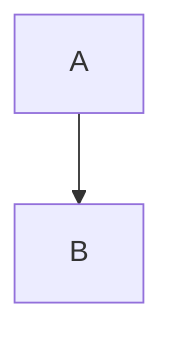

# World-Class README - AI Context

**Purpose**: AI agent context document for implementing World-Class README

**Scope**: README transformation from minimal placeholder to professional showcase quality

**Overview**: Comprehensive context document for AI agents working on the World-Class README feature.
    This document provides architectural context, design decisions, and implementation guidance for
    creating a README that serves as the professional front door for the SafeShell project.

**Dependencies**: None - this is Phase 1 of the production roadmap

**Exports**: Context for README structure, content patterns, and visual elements

**Related**: PR_BREAKDOWN.md for implementation tasks, PROGRESS_TRACKER.md for current status

**Implementation**: Model after thai-lint README patterns with SafeShell-specific content

---

## Overview

SafeShell needs a world-class README that:
1. Immediately communicates value to potential users
2. Provides clear getting-started instructions
3. Documents all features and capabilities
4. Establishes professional credibility
5. Enables self-service onboarding

## Project Background

### Current State
- README is 6 lines: title, blank line, 2-sentence description
- No badges, no quick start, no examples
- Documentation exists in `.ai/` folder but not exposed in README

### Target State
- Comprehensive README matching thai-lint quality
- Badges for license, Python version, tests, coverage
- Architecture diagram with Mermaid
- Quick Start guide
- CLI reference
- Configuration documentation
- Integration instructions

### Reference Material
- **Thai-lint README**: ~/Projects/thai-lint/README.md (1400+ lines, comprehensive)
- **SafeShell architecture**: .ai/docs/PROJECT_CONTEXT.md
- **CLI commands**: .ai/howtos/how-to-use-safeshell-cli.md
- **Rules guide**: .ai/howtos/how-to-write-rules.md

## Feature Vision

### Primary Goals
1. **First Impression**: README is the first thing users see - must be professional
2. **Self-Service**: Users should be able to set up SafeShell without external help
3. **Comprehensive**: Cover all features without being overwhelming
4. **Accurate**: All examples must be tested and working

### Atemporal Language Requirement
**Critical**: All documentation must use atemporal language:
- ❌ "We will add..." / "Coming soon..." / "In the future..."
- ❌ "Currently..." / "At this time..." / "For now..."
- ✅ "SafeShell provides..." / "Users can..." / "The system..."

## Current Application Context

### SafeShell Architecture
SafeShell uses a hybrid shim + daemon architecture:

1. **Command Shims** (`~/.safeshell/shims/`)
   - Symlinks to safeshell-shim script
   - Intercept external commands (git, rm, docker, etc.)
   - Prepend to PATH for transparent interception

2. **Shell Function Overrides** (`init.bash`)
   - Override builtins (cd, source, eval)
   - Cannot use shims for shell builtins

3. **Shell Wrapper** (`safeshell-wrapper`)
   - AI tools set SHELL=/path/to/safeshell-wrapper
   - Intercepts all commands from that tool

4. **Daemon** (`safeshell daemon`)
   - Unix socket server
   - Loads and evaluates rules
   - Manages approval workflow

5. **Monitor TUI** (`safeshell monitor`)
   - Real-time event stream
   - Approval workflow UI
   - Debug visibility

### CLI Commands
```
safeshell init          # Initialize config, rules, shims
safeshell check "<cmd>" # Check if command would be allowed
safeshell status        # Show daemon status
safeshell refresh       # Regenerate shims from rules
safeshell monitor       # Launch TUI
safeshell daemon start  # Start daemon
safeshell daemon stop   # Stop daemon
safeshell daemon restart # Restart daemon
```

### Rules System
Rules defined in YAML with:
- `pattern`: Glob/regex for command matching
- `conditions`: Bash expressions that must all exit 0
- `action`: allow, deny, require_approval, redirect
- `ai_only` / `human_only`: Context-aware filtering

## Target Architecture

### README Structure
Model after thai-lint with these sections:

1. **Header**
   - Title with badges
   - One-liner description
   - Key links (docs, PyPI, etc.)

2. **Why SafeShell?**
   - Problem statement
   - Solution benefits
   - Use cases

3. **Architecture**
   - Mermaid diagram
   - Component descriptions
   - Data flow explanation

4. **Features**
   - Command interception
   - Rules engine
   - Monitor TUI
   - Integrations

5. **Quick Start**
   - Prerequisites
   - Installation
   - Configuration
   - First run

6. **Installation**
   - Multiple methods
   - Development setup

7. **Configuration**
   - Config file locations
   - Rules format
   - Examples

8. **CLI Reference**
   - All commands
   - Options and flags
   - Examples

9. **Integrations**
   - Claude Code setup
   - Shell integration

10. **Contributing**
    - Development setup
    - Guidelines
    - PR process

11. **Footer**
    - License
    - Support
    - Acknowledgments

### User Journey
1. Land on GitHub repository
2. See badges and one-liner (credibility established)
3. Read "Why SafeShell?" (problem/solution understood)
4. View architecture diagram (system understood)
5. Follow Quick Start (working setup in 5 minutes)
6. Reference CLI and config sections as needed

## Key Decisions Made

### Mermaid for Diagrams
- **Decision**: Use Mermaid instead of images
- **Rationale**: Renders in GitHub and MkDocs, easy to maintain, version-controlled

### Thai-lint as Template
- **Decision**: Model README structure after thai-lint
- **Rationale**: Proven professional quality, same author, consistent style

### Atemporal Language
- **Decision**: No temporal language anywhere
- **Rationale**: Documentation stays accurate regardless of when read

### Two PRs
- **Decision**: Split into structure (PR1) and content (PR2)
- **Rationale**: Allows review of visual elements before filling in details

## Integration Points

### With Existing Documentation
- Reference `.ai/howtos/` for detailed guides
- Link to rules guide for advanced configuration
- Point to PROJECT_CONTEXT.md for architecture details

### With Future Phases
- README links to docs site (Phase 8)
- Badges link to CI (Phase 2)
- PyPI badge added in Phase 9

## Success Metrics

### Qualitative
- Professional appearance matching thai-lint
- Clear value proposition
- Self-service onboarding capability

### Quantitative
- Quick Start completable in 5 minutes
- All code examples tested and working
- Zero temporal language violations
- All links verified working

## Technical Constraints

### GitHub Markdown
- Must render correctly on GitHub
- Mermaid diagrams supported
- Tables supported
- Collapsible sections supported

### Badge Dependencies
- Test badge requires test.yml workflow (Phase 2)
- Coverage badge requires Codecov setup (Phase 2)
- PyPI badge added after publication (Phase 9)
- Use placeholder or omit until ready

### Link Stability
- Only link to files that exist
- No broken links to planned features
- Internal links use relative paths

## AI Agent Guidance

### When Writing README Content
1. Use present tense exclusively
2. Test all code examples before including
3. Verify all links work
4. Match thai-lint formatting patterns
5. Keep sections scannable with headers and bullets

### When Creating Diagrams
1. Use Mermaid syntax
2. Test in GitHub preview
3. Keep diagrams focused and readable
4. Use consistent styling

### Common Patterns

**Badge Format:**
```markdown
[](URL)
```

**Code Block with Language:**
```markdown
```bash
command --flag argument
```
```

**Table Format:**
```markdown
| Column 1 | Column 2 |
|----------|----------|
| Value 1  | Value 2  |
```

**Mermaid Diagram:**
```markdown

```

## Risk Mitigation

### Risk: Inaccurate Examples
**Mitigation**: Test all code examples in clean environment before including

### Risk: Broken Links
**Mitigation**: Verify all links work, use relative paths for internal links

### Risk: Outdated Information
**Mitigation**: Reference source code and existing docs, not assumptions

### Risk: Temporal Language Slip
**Mitigation**: Review all text for temporal phrases before committing

## Future Enhancements

### After Phase 2 (CI/CD)
- Add working test badge
- Add coverage badge
- Add CI status badge

### After Phase 8 (Documentation)
- Add documentation badge
- Link to Read the Docs site

### After Phase 9 (PyPI)
- Add PyPI badge
- Add pip install instructions
