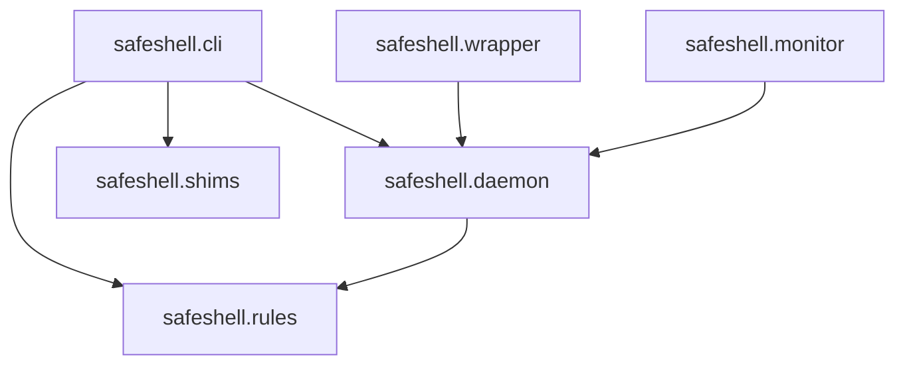

# Architecture Review & Refactoring - PR Breakdown

**Purpose**: Detailed implementation breakdown of Architecture Review & Refactoring into manageable, atomic pull requests

**Scope**: Complete architecture validation and code refactoring from POC to production quality

**Overview**: Comprehensive breakdown of the Architecture Review & Refactoring phase into 4 manageable, atomic
    pull requests. Each PR is designed to be self-contained, testable, and maintains application functionality
    while incrementally improving code quality. Includes detailed implementation steps, file structures,
    testing requirements, and success criteria for each PR.

**Dependencies**: All MVP features (daemon, rules engine, shim system, approval workflow, monitoring)

**Exports**: PR implementation plans, file structures, testing strategies, and success criteria for each development phase

**Related**: AI_CONTEXT.md for feature overview, PROGRESS_TRACKER.md for status tracking

**Implementation**: Atomic PR approach with detailed step-by-step implementation guidance and comprehensive testing validation

---

## Overview
This document breaks down the Architecture Review & Refactoring phase into manageable, atomic PRs. Each PR is designed to be:
- Self-contained and testable
- Maintains a working application
- Incrementally improves code quality
- Revertible if needed

---

## PR1: Architecture Review Document

### Scope
Conduct comprehensive architecture review and create detailed analysis document without making code changes.

### Files to Create
- `docs/ARCHITECTURE_REVIEW.md` (new comprehensive review document)

### Detailed Steps

#### Step 1: Review Daemon Architecture
Analyze `src/safeshell/daemon/` components:

**Analysis Areas:**
1. **Asyncio Server Design** (`server.py`)
   - Connection handling strategy
   - Event loop management
   - Error handling patterns
   - Concurrent connection handling

2. **Daemon Lifecycle** (`manager.py`)
   - Start/stop/restart implementation
   - PID file management
   - Process cleanup

3. **Protocol Design** (`protocol.py`)
   - Message format and serialization
   - Request/response patterns
   - Error handling

**Document in Review:**
```markdown
## Daemon Architecture

### Current Implementation
[Detailed description of asyncio Unix socket approach]

### Design Rationale
- Asyncio chosen for efficient concurrent connection handling
- Unix sockets for local IPC with security benefits
- Event-driven architecture for monitor integration

### Strengths
- Handles multiple clients concurrently
- Non-blocking I/O for responsive daemon
- Clean separation of server and protocol logic

### Weaknesses
- Error handling inconsistencies across handlers
- Limited connection lifecycle logging
- No connection pooling or rate limiting

### Alternatives Considered
- Threading: Simpler but less scalable
- Multiprocessing: More overhead for IPC use case
- HTTP server: More overhead, unnecessary complexity

### Recommendations
- Standardize error handling patterns
- Add connection lifecycle logging
- Consider rate limiting for security
```

#### Step 2: Review Rules Engine
Analyze `src/safeshell/rules/` components:

**Analysis Areas:**
1. **Schema Design** (`schema.py`)
   - Pydantic model structure
   - Validation rules
   - Extensibility considerations

2. **Rule Evaluation** (`evaluator.py`)
   - Matching algorithm
   - Condition evaluation approach
   - Performance characteristics

3. **YAML Loading** (`loader.py`)
   - File loading strategy
   - Error handling
   - Rule merging logic

**Document in Review:**
```markdown
## Rules Engine

### Current Implementation
[Detailed description of YAML-based rules system]

### Design Rationale
- YAML for human-readable configuration
- Bash subprocess for condition evaluation
- Pydantic for schema validation

### Strengths
- Flexible and extensible rule format
- Leverages shell scripting knowledge
- Strong validation via Pydantic

### Weaknesses
- Bash subprocess overhead for conditions
- Security considerations with subprocess execution
- Limited performance optimization
- Rule precedence not fully documented

### Alternatives Considered
- Python expressions: More secure but less familiar
- DSL: More complex, higher learning curve
- JSON: Less human-friendly

### Recommendations
- Document rule precedence clearly
- Add subprocess timeout enforcement
- Consider caching evaluation results
- Implement rule performance profiling
```

#### Step 3: Review Shim System
Analyze `src/safeshell/shims/` components:

**Analysis Areas:**
1. **Shim Generation** (`manager.py`)
   - Symlink creation strategy
   - PATH manipulation
   - Cross-shell compatibility

2. **Shell Function Overrides** (`init.bash`)
   - Builtin override mechanism
   - Shell compatibility
   - Performance impact

**Document in Review:**
```markdown
## Shim System

### Current Implementation
[Detailed description of symlink-based interception]

### Design Rationale
- Symlinks for transparent command interception
- Shell functions for builtin overrides
- PATH prepending for precedence

### Strengths
- Transparent to intercepted commands
- Works with existing binaries
- Minimal performance overhead

### Weaknesses
- Shell function approach limited to bash/zsh
- Potential conflicts with user shell functions
- Shim regeneration required for rule changes

### Alternatives Considered
- LD_PRELOAD: Too invasive, complex
- Alias-based: Easier to bypass
- Wrapper scripts: More overhead

### Recommendations
- Document shell compatibility requirements
- Add conflict detection for existing functions
- Consider automatic shim refresh on rule changes
```

#### Step 4: Review Approval Workflow
Analyze `src/safeshell/wrapper/` components:

**Analysis Areas:**
1. **Shell Wrapper** (`shell.py`)
   - Command interception flow
   - Communication with daemon
   - Error handling

2. **Client Protocol** (`client.py`)
   - Daemon communication
   - Timeout handling
   - State management

**Document in Review:**
```markdown
## Approval Workflow

### Current Implementation
[Detailed description of blocking approval flow]

### Design Rationale
- Blocking approach for safety
- Timeout for UX (prevent indefinite waits)
- State managed in daemon

### Strengths
- Simple and reliable
- Clear user experience
- Safe default behavior

### Weaknesses
- Blocking can feel slow
- Timeout handling edge cases
- Limited batch approval support

### Alternatives Considered
- Non-blocking: More complex state management
- Async approval: Could miss approvals
- Always-block: Poor UX for trusted commands

### Recommendations
- Document timeout behavior clearly
- Consider batch approval for repeated commands
- Add approval history/audit log
```

#### Step 5: Review Module Dependencies
Create dependency graph and analyze:

**Analysis Areas:**
1. Module coupling and cohesion
2. Circular dependency risks
3. Interface clarity
4. Dependency direction

**Document in Review:**
```markdown
## Module Dependencies

### Current Dependency Graph


### Analysis
- Clear separation between CLI, daemon, and client
- Rules engine properly isolated
- No circular dependencies detected

### Recommendations
- Formalize interfaces between modules
- Consider dependency injection for testing
- Document public vs internal APIs
```

#### Step 6: Catalog Technical Debt
Systematically review entire codebase:

**Tasks:**
1. Search for TODO/FIXME comments
2. Identify unused imports
3. Find dead code
4. Note inconsistent patterns
5. Document intentional shortcuts

**Document in Review:**
```markdown
## Technical Debt Catalog

### High Priority

#### TODO-001: Error Handling Consistency
**Location**: Multiple modules
**Severity**: High
**Description**: Error handling patterns vary across modules
**Rationale**: POC focus on functionality over consistency
**Impact**: Harder to debug, inconsistent user experience
**Resolution**: Standardize error handling patterns
**Effort**: 2-3 days

### Medium Priority

#### TODO-002: Logging Strategy
**Location**: All modules
**Severity**: Medium
**Description**: Logging levels and formats inconsistent
**Rationale**: Added logging ad-hoc during development
**Impact**: Difficult debugging and monitoring
**Resolution**: Implement consistent logging strategy
**Effort**: 1-2 days

### Low Priority

#### TODO-003: Code Duplication
**Location**: daemon/server.py, wrapper/client.py
**Severity**: Low
**Description**: Similar socket handling code
**Rationale**: Developed independently
**Impact**: Maintenance overhead
**Resolution**: Extract shared utilities
**Effort**: 1 day
```

### Testing Requirements
- [ ] Architecture review is comprehensive
- [ ] All modules analyzed systematically
- [ ] Design rationale documented for key decisions
- [ ] Technical debt catalog is complete
- [ ] Review document is readable and well-structured

### Success Criteria
- [ ] Architecture review document created
- [ ] All four core components reviewed (daemon, rules, shims, approval)
- [ ] Alternatives documented for each design decision
- [ ] Technical debt catalog with severity ratings
- [ ] Specific recommendations for each component
- [ ] Module dependency graph created

---

## PR2: Code Cleanup - Dead Code & Imports

### Scope
Remove dead code, unused imports, and commented-out code blocks. Low-risk changes to clean up codebase.

### Files to Modify
- All files in `src/safeshell/` (specific files identified during PR1 review)

### Detailed Steps

#### Step 1: Remove Unused Imports
Use automated tools and manual review:

**Process:**
```bash
# Use ruff to identify unused imports
ruff check --select F401 src/

# Review and remove each unused import
# Verify tests still pass after each file
```

**Files likely affected:**
- `src/safeshell/daemon/server.py`
- `src/safeshell/rules/evaluator.py`
- `src/safeshell/wrapper/shell.py`
- `src/safeshell/monitor/app.py`

#### Step 2: Remove Dead Code
Identify and remove unreachable or unused code:

**Search patterns:**
```bash
# Find commented-out code blocks
grep -r "# def " src/
grep -r "# class " src/

# Find unused functions (manual review required)
# Check git history for why code was commented
```

**Common patterns to remove:**
- Commented-out function definitions
- Unused utility functions
- Debug print statements
- Experimental code blocks

#### Step 3: Remove Debug Code
Clean up debug artifacts:

**Patterns:**
- `print()` statements used for debugging
- `import pdb; pdb.set_trace()`
- Temporary logging statements
- Test code in production modules

#### Step 4: Clean Up TODO/FIXME Comments
For each TODO/FIXME:
1. Evaluate if it's still relevant
2. Create issue in GitHub if needed
3. Remove or update comment
4. Document in technical debt catalog if needed

**Process:**
```bash
# Find all TODO/FIXME comments
grep -r "TODO\|FIXME" src/

# For each:
# - If done: remove comment
# - If needed: create GitHub issue and update comment with issue number
# - If obsolete: remove comment
```

### Testing Requirements
- [ ] All existing tests pass
- [ ] No reduction in test coverage
- [ ] Manual testing of core functionality
- [ ] Verify no imports removed that are used indirectly

### Success Criteria
- [ ] Zero unused imports (verified by ruff)
- [ ] No commented-out code blocks
- [ ] All TODO/FIXME comments addressed
- [ ] All debug code removed
- [ ] Tests pass with 100% success rate

---

## PR3: Code Cleanup - Consistency & Consolidation

### Scope
Improve code consistency and consolidate duplicate logic. Medium-risk refactoring for better maintainability.

### Files to Modify
- Multiple files across `src/safeshell/` as identified in PR1 review

### Detailed Steps

#### Step 1: Standardize Naming Conventions
Ensure consistent naming across codebase:

**Patterns to standardize:**
- Function names: `snake_case`
- Class names: `PascalCase`
- Constants: `UPPER_SNAKE_CASE`
- Private methods: `_leading_underscore`
- Module names: `lowercase`

**Review each module:**
```python
# Before (inconsistent)
def HandleCommand(cmd): ...
def process_command(cmd): ...

# After (consistent)
def handle_command(cmd): ...
def process_command(cmd): ...
```

#### Step 2: Standardize Error Handling
Implement consistent error handling pattern:

**Pattern to apply:**
```python
# Consistent error handling
try:
    result = risky_operation()
except SpecificError as e:
    logger.error("Operation failed: %s", e)
    raise SafeShellError("User-friendly message") from e
except Exception as e:
    logger.exception("Unexpected error in operation")
    raise SafeShellError("Something went wrong") from e
```

**Apply to:**
- Daemon connection handling
- Rule evaluation
- Shim operations
- Client communication

#### Step 3: Standardize Logging Strategy
Implement consistent logging:

**Pattern:**
```python
import logging

logger = logging.getLogger(__name__)

# Use appropriate levels consistently
logger.debug("Detailed diagnostic info")
logger.info("General informational messages")
logger.warning("Warning messages")
logger.error("Error messages")
logger.exception("Error with traceback")
```

**Logging guidelines:**
- DEBUG: Detailed diagnostic information
- INFO: Confirmation that things are working
- WARNING: Indication of potential problems
- ERROR: Serious problems

#### Step 4: Consolidate Duplicate Logic
Extract and consolidate duplicate code:

**Common patterns to extract:**

1. **Socket Communication**
```python
# Create shared utility module
# src/safeshell/common/socket_utils.py

def send_message(sock, message):
    """Send message over socket with consistent error handling."""
    ...

def receive_message(sock, timeout=None):
    """Receive message from socket with timeout."""
    ...
```

2. **Configuration Loading**
```python
# Create shared config utilities
# src/safeshell/common/config_utils.py

def load_yaml_config(path):
    """Load and validate YAML config file."""
    ...

def merge_configs(global_config, local_config):
    """Merge global and local configurations."""
    ...
```

3. **Path Utilities**
```python
# Create shared path utilities
# src/safeshell/common/path_utils.py

def ensure_safeshell_dir():
    """Ensure SafeShell directory exists."""
    ...

def get_config_path():
    """Get config file path."""
    ...
```

#### Step 5: Improve Docstring Consistency
Standardize docstring format:

**Pattern (Google style):**
```python
def function_name(param1: str, param2: int) -> bool:
    """Short description of function.

    Longer description if needed, explaining behavior
    and any important details.

    Args:
        param1: Description of param1
        param2: Description of param2

    Returns:
        Description of return value

    Raises:
        ValueError: Description of when raised
    """
    ...
```

**Apply to all:**
- Public functions
- Public classes
- Module-level docstrings

### Testing Requirements
- [ ] All existing tests pass
- [ ] Test coverage maintained or improved
- [ ] Integration tests validate end-to-end functionality
- [ ] Manual testing of all CLI commands
- [ ] Performance benchmarks show no regression

### Success Criteria
- [ ] Consistent naming conventions throughout
- [ ] Standardized error handling patterns
- [ ] Consistent logging strategy implemented
- [ ] Duplicate code consolidated
- [ ] All public APIs have proper docstrings
- [ ] Tests pass with 100% success rate

---

## PR4: Refactoring & Module Boundaries

### Scope
Refactor code based on architecture review findings. Improve module boundaries and interfaces.

### Files to Modify
- Multiple files across `src/safeshell/` based on PR1 recommendations
- Potential new files for shared utilities

### Detailed Steps

#### Step 1: Create Common Utilities Module
Create shared utilities based on PR3 consolidation:

**New module structure:**
```
src/safeshell/common/
├── __init__.py
├── socket_utils.py      # Shared socket operations
├── config_utils.py      # Configuration loading/merging
├── path_utils.py        # Path operations
└── exceptions.py        # Custom exception hierarchy
```

**Implementation:**
1. Create module structure
2. Move shared utilities
3. Update imports in dependent modules
4. Verify tests pass

#### Step 2: Refactor Daemon Connection Handling
Improve connection lifecycle management:

**Changes:**
```python
# Add connection context manager
class DaemonConnection:
    """Context manager for daemon connections."""

    def __enter__(self):
        self.connect()
        return self

    def __exit__(self, exc_type, exc_val, exc_tb):
        self.disconnect()
        return False

# Usage
with DaemonConnection() as conn:
    result = conn.send_command(cmd)
```

#### Step 3: Refactor Rule Evaluation
Optimize rule evaluation based on review findings:

**Improvements:**
1. Add caching for condition evaluation results
2. Implement rule evaluation timeout enforcement
3. Add performance profiling hooks
4. Document rule precedence clearly

**Example:**
```python
class RuleEvaluator:
    def __init__(self):
        self._cache = {}
        self._stats = defaultdict(int)

    def evaluate_with_cache(self, rule, context):
        """Evaluate rule with result caching."""
        cache_key = self._make_cache_key(rule, context)
        if cache_key in self._cache:
            self._stats['cache_hits'] += 1
            return self._cache[cache_key]

        self._stats['cache_misses'] += 1
        result = self._evaluate(rule, context)
        self._cache[cache_key] = result
        return result
```

#### Step 4: Improve Module Interfaces
Define clear interfaces between modules:

**Create interface definitions:**
```python
# src/safeshell/daemon/interface.py
from abc import ABC, abstractmethod

class DaemonInterface(ABC):
    """Interface for daemon implementations."""

    @abstractmethod
    def start(self) -> None:
        """Start the daemon."""
        pass

    @abstractmethod
    def stop(self) -> None:
        """Stop the daemon."""
        pass

    @abstractmethod
    def evaluate_command(self, command: str) -> EvaluationResult:
        """Evaluate a command against rules."""
        pass
```

#### Step 5: Refactor Approval Workflow
Improve based on review recommendations:

**Enhancements:**
1. Add approval history tracking
2. Implement batch approval consideration
3. Improve timeout handling documentation
4. Add state persistence for pending approvals

**Example:**
```python
class ApprovalManager:
    def __init__(self):
        self._pending = {}
        self._history = []

    def request_approval(self, command, timeout):
        """Request approval with history tracking."""
        request_id = self._generate_id()
        self._pending[request_id] = ApprovalRequest(
            command=command,
            timestamp=time.time(),
            timeout=timeout
        )
        return request_id

    def approve(self, request_id):
        """Approve request and record in history."""
        request = self._pending.pop(request_id)
        self._history.append(ApprovalHistory(
            request=request,
            decision='approved',
            timestamp=time.time()
        ))
```

### Testing Requirements
- [ ] All existing tests pass
- [ ] New tests for refactored code
- [ ] Integration tests validate end-to-end functionality
- [ ] Performance benchmarks show improvement or no regression
- [ ] Manual testing of all core features

### Success Criteria
- [ ] Common utilities module created and used
- [ ] Connection handling improved
- [ ] Rule evaluation optimized
- [ ] Clear module interfaces defined
- [ ] Approval workflow enhanced
- [ ] Tests pass with 100% success rate
- [ ] Architecture review recommendations implemented

---

## Implementation Guidelines

### Code Standards
- Follow PEP 8 style guidelines
- Use type hints for all function signatures
- Write docstrings for all public APIs
- Keep functions focused and single-purpose
- Maximum function length: 50 lines

### Testing Requirements
- Run full test suite after each change
- Maintain or improve test coverage
- Add tests for new utilities and refactored code
- Validate with integration tests
- Benchmark performance-critical sections

### Documentation Standards
- **Atemporal language only**: Document what code does, not what it will do
- **Clear and concise**: Focus on essential information
- **Examples**: Provide usage examples where helpful
- **Type hints**: Use for better IDE support and documentation

### Security Considerations
- Validate all inputs in refactored code
- Ensure subprocess timeout enforcement
- Maintain least-privilege principles
- Document security implications of changes

### Performance Targets
- Command interception latency: < 10ms
- Rule evaluation: < 5ms per rule
- Daemon startup time: < 1s
- No performance regression from refactoring

## Rollout Strategy

### Phase 1: Analysis (PR1)
- Conduct comprehensive architecture review
- Document findings without code changes
- Create technical debt catalog
- Get review and alignment on findings

### Phase 2: Low-Risk Cleanup (PR2)
- Remove dead code and unused imports
- Clean up debug artifacts
- Address TODO/FIXME comments
- Verify no functionality broken

### Phase 3: Consistency (PR3)
- Standardize naming and patterns
- Consolidate duplicate logic
- Improve error handling and logging
- Maintain full functionality

### Phase 4: Refactoring (PR4)
- Implement review recommendations
- Improve module boundaries
- Optimize based on findings
- Enhance core functionality

## PR5: Test Coverage Improvement

### Scope
Improve test coverage from 51% to 80%+ to enable stricter CI/CD coverage thresholds. Focus on untested modules and critical code paths.

### Files to Modify
- Tests in `tests/` directory (new and expanded)
- `.github/workflows/test.yml` (update coverage threshold)

### Current Coverage Analysis
Based on CI/CD Phase 2 analysis:
- **0% coverage**: `shims/manager.py`, `wrapper/shell.py`, `hooks/claude_code_hook.py`, `shims/__init__.py`
- **21-29% coverage**: `monitor/app.py`, `wrapper/cli.py`, `monitor/widgets.py`
- **51-54% coverage**: `wrapper/client.py`, `monitor/client.py`
- **90%+ coverage**: `models.py`, `rules/evaluator.py`, `rules/loader.py`, `rules/schema.py`

### Detailed Steps

#### Step 1: Add Tests for Shim System
Create comprehensive tests for `src/safeshell/shims/`:

**New test file:** `tests/shims/test_manager.py`
```python
"""Tests for shim manager module."""

def test_create_shim():
    """Test shim creation for a command."""
    ...

def test_remove_shim():
    """Test shim removal."""
    ...

def test_refresh_shims():
    """Test shim refresh from rules."""
    ...

def test_shim_directory_creation():
    """Test shims directory is created if missing."""
    ...
```

#### Step 2: Add Tests for Wrapper Shell
Create tests for `src/safeshell/wrapper/shell.py`:

**New test file:** `tests/wrapper/test_shell.py`
```python
"""Tests for shell wrapper module."""

def test_command_interception():
    """Test command is intercepted and sent to daemon."""
    ...

def test_command_allowed():
    """Test allowed command executes."""
    ...

def test_command_denied():
    """Test denied command is blocked."""
    ...

def test_daemon_connection_failure():
    """Test graceful handling of daemon connection failure."""
    ...
```

#### Step 3: Add Tests for Claude Code Hook
Create tests for `src/safeshell/hooks/claude_code_hook.py`:

**New test file:** `tests/hooks/test_claude_code_hook.py`
```python
"""Tests for Claude Code hook integration."""

def test_pretooluse_hook_allow():
    """Test hook allows safe commands."""
    ...

def test_pretooluse_hook_deny():
    """Test hook denies dangerous commands."""
    ...

def test_pretooluse_hook_approval():
    """Test hook triggers approval flow."""
    ...

def test_hook_output_format():
    """Test hook output matches Claude Code expectations."""
    ...
```

#### Step 4: Add Tests for Monitor TUI
Expand tests for `src/safeshell/monitor/`:

**Expand:** `tests/monitor/test_app.py`
```python
"""Tests for monitor TUI application."""

def test_app_startup():
    """Test TUI application starts correctly."""
    ...

def test_event_display():
    """Test events are displayed in TUI."""
    ...

def test_approval_buttons():
    """Test approve/deny buttons function correctly."""
    ...
```

**New:** `tests/monitor/test_widgets.py`
```python
"""Tests for monitor TUI widgets."""

def test_event_panel_rendering():
    """Test event panel renders correctly."""
    ...

def test_approval_dialog():
    """Test approval dialog displays correctly."""
    ...
```

#### Step 5: Add Integration Tests
Create end-to-end integration tests:

**New test file:** `tests/integration/test_full_workflow.py`
```python
"""Integration tests for complete approval workflow."""

def test_command_interception_to_approval():
    """Test full flow from command to approval."""
    ...

def test_rule_evaluation_to_action():
    """Test rule matching triggers correct action."""
    ...

def test_shim_to_daemon_communication():
    """Test shim properly communicates with daemon."""
    ...
```

#### Step 6: Update CI Coverage Threshold
After achieving 80%+ coverage:

**Update `.github/workflows/test.yml`:**
```yaml
- name: Check coverage threshold
  run: poetry run coverage report --fail-under=80
```

### Testing Requirements
- [ ] All new tests pass
- [ ] Coverage increased to 80%+
- [ ] No existing tests broken
- [ ] Integration tests validate end-to-end functionality
- [ ] Tests are maintainable and well-documented

### Success Criteria
- [ ] Test coverage increased from 51% to 80%+
- [ ] All 0% coverage modules have meaningful tests
- [ ] CI coverage threshold updated to 80%
- [ ] Integration tests cover critical workflows
- [ ] Tests are reliable (no flaky tests)
- [ ] Test execution time remains reasonable (< 60 seconds)

---

## Success Metrics

### Launch Metrics
- [ ] Architecture review document complete
- [ ] Zero dead code remaining
- [ ] Consistent patterns throughout codebase
- [ ] All review recommendations addressed
- [ ] Test coverage at 80%+
- [ ] Tests pass with 100% success rate
- [ ] No performance regression

### Ongoing Metrics
- [ ] Code maintainability improved
- [ ] Debugging is easier with consistent patterns
- [ ] New contributors can understand architecture
- [ ] Technical debt is documented and managed
- [ ] Coverage threshold enforced in CI
