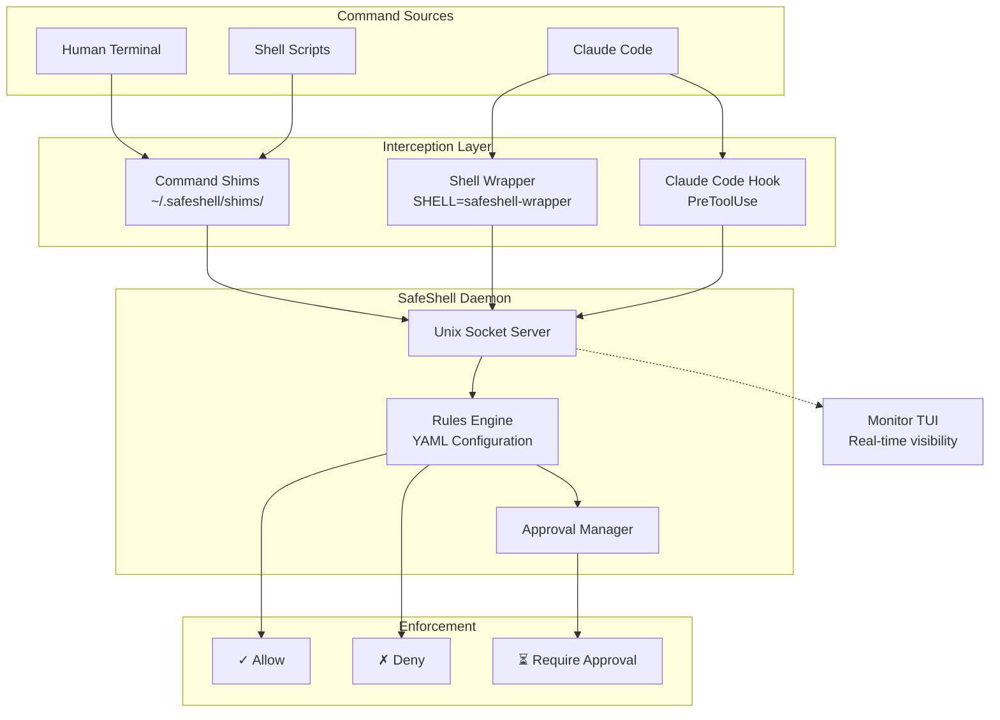

# SafeShell

[](https://opensource.org/licenses/MIT)
[](https://www.python.org/downloads/)

**Command-line safety layer for AI coding assistants.**

SafeShell intercepts shell commands from AI tools like Claude Code, evaluates them against configurable rules, and enforces decisions before execution. Protect your system from accidental `rm -rf`, prevent exposure of sensitive files, and maintain control over what AI assistants can do on your machine.

## Why SafeShell?

AI coding assistants are powerful but operate with your shell permissions. Without guardrails:
- A misunderstood request could delete important files
- Sensitive data (SSH keys, credentials) could be exposed
- Destructive git operations could corrupt repositories
- System configurations could be modified unexpectedly

SafeShell provides:
- **Rule-Based Protection**: YAML-configured rules match commands by pattern, context, or bash conditions
- **Approval Workflow**: Require human approval for risky operations
- **Real-Time Monitoring**: Watch all commands in a terminal UI
- **Context Awareness**: Different rules for AI tools vs human operators

## Architecture

SafeShell uses a hybrid shim + daemon architecture for comprehensive command interception:



### Component Overview

| Component | Purpose |
|-----------|---------|
| **Command Shims** | Symlinks in `~/.safeshell/shims/` that intercept external commands (git, rm, docker, etc.) |
| **Shell Function Overrides** | Override shell builtins (cd, source, eval) via `init.bash` |
| **Shell Wrapper** | AI tools set `SHELL=safeshell-wrapper` to intercept all commands |
| **Daemon** | Unix socket server that loads rules, evaluates commands, and manages approvals |
| **Monitor TUI** | Real-time terminal UI for command visibility and approval workflow |

## Features

### Command Interception
- **Shim-based interception** for external commands (git, rm, docker, etc.)
- **Shell function overrides** for builtins (cd, source, eval)
- **AI tool hooks** for Claude Code integration
- **Transparent pass-through** for allowed commands

### Rules Engine
- **YAML configuration** with global and per-repository rules
- **Bash conditions** for complex matching logic
- **Context-aware filtering** with `ai_only` and `human_only` rules
- **Action types**: allow, deny, require_approval, redirect

### Monitor TUI
- **Real-time event stream** of all intercepted commands
- **Approval workflow** with approve/deny buttons
- **Debug mode** for rule evaluation visibility
- **Keyboard navigation** for efficient operation

### Integrations
- **Claude Code** via PreToolUse hook
- **Shell integration** via init.bash sourcing

## Quick Start

### 1. Install SafeShell

```bash
# From source (recommended during development)
git clone https://github.com/be-wise-be-kind/safeshell.git
cd safeshell
poetry install
```

### 2. Initialize Configuration

```bash
safeshell init
```

This creates:
- `~/.safeshell/config.yaml` - Global configuration
- `~/.safeshell/rules.yaml` - Global rules
- `~/.safeshell/shims/` - Command shims

### 3. Start the Daemon

```bash
safeshell daemon start
```

### 4. Integrate with Your Shell

Add to your `~/.bashrc` or `~/.zshrc`:

```bash
source ~/.safeshell/init.bash
```

### 5. Test the Setup

```bash
# Check a command without executing
safeshell check "rm -rf /"

# Start the monitor to see real-time events
safeshell monitor
```

## Installation

### Prerequisites
- Python 3.11 or higher
- Poetry (for development installation)

### From Source

```bash
git clone https://github.com/be-wise-be-kind/safeshell.git
cd safeshell
poetry install
```

### Development Installation

```bash
# Clone and install with dev dependencies
git clone https://github.com/be-wise-be-kind/safeshell.git
cd safeshell
poetry install --with dev

# Run tests
poetry run pytest

# Run linting
poetry run ruff check src/
```

## Configuration

SafeShell uses YAML configuration files at two levels:

### Global Configuration

`~/.safeshell/config.yaml`:

```yaml
socket_path: /tmp/safeshell.sock
log_level: INFO
approval_timeout_seconds: 300
condition_timeout_ms: 100
```

### Rules Configuration

`~/.safeshell/rules.yaml` (global) and `.safeshell/rules.yaml` (per-repo):

```yaml
rules:
  - name: block-rm-rf
    description: Block recursive force delete
    pattern: "rm -rf"
    action: deny

  - name: approve-git-push-force
    description: Require approval for force push
    pattern: "git push --force"
    action: require_approval

  - name: block-sensitive-files
    description: Block access to SSH keys
    conditions:
      - "echo $SAFESHELL_COMMAND | grep -q '\\.ssh'"
    action: deny
    ai_only: true
```

See [Rules Guide](.ai/howtos/how-to-write-rules.md) for complete documentation.

## CLI Reference

### Core Commands

| Command | Description |
|---------|-------------|
| `safeshell init` | Initialize configuration and shims |
| `safeshell check "<cmd>"` | Check if a command would be allowed |
| `safeshell status` | Show daemon status |
| `safeshell refresh` | Regenerate shims from rules |

### Daemon Commands

| Command | Description |
|---------|-------------|
| `safeshell daemon start` | Start the background daemon |
| `safeshell daemon stop` | Stop the daemon |
| `safeshell daemon restart` | Restart the daemon |
| `safeshell daemon status` | Check daemon status |

### Monitor Commands

| Command | Description |
|---------|-------------|
| `safeshell monitor` | Launch the monitor TUI |
| `safeshell monitor --debug` | Launch with debug panes visible |

## Integrations

### Claude Code

SafeShell integrates with Claude Code via a PreToolUse hook that intercepts Bash commands before execution.

**Setup:**

The hook is automatically installed during `safeshell init` at `~/.claude/hooks/safeshell_hook.py`.

**Behavior:**
- `allow` rules: Command executes normally
- `deny` rules: Command is blocked with explanation
- `require_approval` rules: Command waits for approval in Monitor TUI

## Contributing

Contributions are welcome! Please follow these steps:

1. Fork the repository
2. Create a feature branch (`git checkout -b feature/amazing-feature`)
3. Make your changes
4. Run tests and linting (`poetry run pytest && poetry run ruff check src/`)
5. Commit your changes
6. Push to the branch (`git push origin feature/amazing-feature`)
7. Open a Pull Request

### Development Guidelines
- Write tests for new features
- Follow existing code style (enforced by Ruff)
- Add type hints to all functions
- Update documentation for user-facing changes

## License

MIT License

## Support

- **Issues**: https://github.com/be-wise-be-kind/safeshell/issues
- **Documentation**: [.ai/docs/](.ai/docs/) and [.ai/howtos/](.ai/howtos/)

## Acknowledgments

Built with:
- [Typer](https://typer.tiangolo.com/) - CLI framework
- [Textual](https://textual.textualize.io/) - TUI framework
- [Pydantic](https://docs.pydantic.dev/) - Data validation
- [Rich](https://rich.readthedocs.io/) - Terminal formatting
